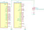

# <big>`01-clock-tree` Example</big>

The purpose of this example is to demonstrate the clock tree setup of a 
STM32xxxx MCU using the **bmt template library**. It also demonstrates 
the use of the GPIO.

# The Example Project

Compile the desired target and run. You will need a frequency counter/meter 
for this experiment.

The example models a System clock and GPIO pins to read frequency on the 
**MCO output pin**. The MCO output pin is conventionally on the **PA8** 
pin.

## BluePill (STM32F103C8)

For the BluePill, connect your frequency counter/meter on the pins 
highlighted on the following picture:

The frequency measured should be 36 MHz.

### Optional Excercises

As an excercise, the following is suggested:
- Use HSE as system clock, results 8 MHz. LED blink will be notably 
slower.
- Use other PLL frequencies. This chip is not so flexible but steps 
around 8MHz are feasible.
- Use HSI as system clock, which oscillates around 8 MHz. In this option 
it should be noticed how accuracy is affected when compared to crystal 
options.

## Nucleo32 L432KC (STM32L432KC)

For the Nucleo32 L432KC the frequency counter has to be connected on the 
folowing highlighted pins:

### Optional Exercises

As an exercise, the following is suggested:
- Try other MSI base frequencies and verify that the PLL output frequency 
keeps unchanged, since the `Clocks::AutoRange1` calculator compute new 
values at compile time.
- Still keeping the PLL as system clock select MSI as output for the MCO 
pin.
- Use HSI instead of the PLL. In this particular case, MSI seems to be 
more accurate without the PLL circuit. Compare with previous test.
- Experiment other MCO divisors.
- Use MSI as system clock without attaching to LSE clock. In this case
occurs a noticeable accuracy loss.
- Still using MSI check other working frequencies.
- In this chip HSI16 is also an option. Establish a data-type for it and 
set it as main clock.

## Nucleo32 G431 (STM32G431KB)

