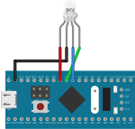

# <big>`02-systick-delay` Example</big>

The purpose of this example is to demonstrate the timing control using 
the SYSTICK timer.

In the example a simple 350 ms delay is used. The SYSTICK timer can be 
used to measure timing but depends totally on clock speed.  

The advantage of using the SYSTICK timer is that you won't waste other 
timer which has far more features that the tick counter, just to produces 
simple delays or time measurements.

For lower CPU clocks, very long delays are possible, since the tick 
counter implementation uses 24 bits. In this example, we show two 
different stopwatch class that extents the range of this counter 
allowing for longer intervals, even for very high system clocks. These 
models uses polling to extend the timer range.


## Type Declaration

The **bmt** library allow the use of the **SysTick** in two different 
modes: 
- As a simple timer and the `Timer::SysTickCounter` class, good enough 
for polled algorithms.
- As an interrupt timer and the `Timer::AnySysTick` or 
`Timer::AnySysTickEx` classes which allows a lower timer resolution, but 
ideal for a collaborative share of the timer functions.

This example covers the first scenario, which is easier from a 
programmatic point of view.  
For this, we need to use the `Timer::SysTickCounter` class, simply 
declared like this:

```cpp
// The data-type representing the system tick timer
typedef Timer::SysTickCounter<SysClk> Tick;
```

The template parameter is the data-type for your clock tree, as seen on 
the previous example. This data-type is required so that the operating 
frequency of the SysTick can be obtained from the clock tree. This 
affects the internal calculators used to compute the amount of ticks 
required for a desired interval.

> Note that if you change the frequency of your your clock tree, the 
> timer logic will be updated during next compilation and everything will 
> work instantly with the new settings. 

Two other type declaration are also done for the complete sample:

```cpp
// This is the model that expands resolution of the Tick counter to 32-bit, 
// but requires moderate polling rates
typedef Timer::MicroStopWatch<Tick> Tick32;
// This is the model with more capabilities
typedef Timer::PolledStopWatch<Tick> StopWatch;
```

The first is a class that binds to any specified timer to compute 
intervals using a 32-bit variable. It mainly implements a method called 
`IsNotElapsed()` to check if the desired time duration has elapsed.

The second definition is the `PolledStopWatch<>` class with an added 
complexity that allows measuring very long periods.

The only drawback of both implementation is that the `IsNotElapsed()` 
method have to be called in a reasonable rate so that internal state is 
correctly updated. This rate is necessarily faster than the total timer 
period for a reload to occur.


## Initialization

To initialize the **SysTick** hardware, simply add the `Init()` method to 
the `SystemInit()` function.

```cpp
// Start tick counter
Tick::Init();
```

> Note that software objects and variables are not valid inside the 
> `SystemInit()` function. Only hardware can be accessed here.  
> If a timer is not needed at the early startup of your firmware, the 
> initialization may also be done in your `main()` function.

# Available Experiments

The example project contains three different tests that is controlled by 
the `kExample` constant.

For example, to Test the *Very Long Period* test use:

```cpp
// Please select one of the example type
static constexpr ExampleType kExample = ExampleType::kVeryLong;
```

Then compile and run your demo. The next topics describes each case.


## 1) Simple Polling Loop

The example implements a simple polling loop to toggle the LED:

```cpp
/*
This is the most generic use of a delay
*/
void SimpleUse()
{
	while (true)
	{
		// In this example we use a simple delay for constant value. The method is 
		// embedded into the system tick timer class.
		Tick::Delay<Timer::Msec(350)>();
		// Toggle the LED
		Led::Toggle();
	}
}
```

The example demonstrates the `Delay<C>()` method of the tick timer, which 
halts CPU for the given period.

An **absolutely important** concept that should be observed in this class 
is that the `Delay()` method has two forms: A template form and a regular 
method that has exactly the same purpose. 

```cpp
// ...
class SysTickCounter
{
	//...
	/// Constant delay of CPU in ms (optimized code)
	template<Msec kMS> constexpr static void Delay()
	{
		// ...
	}
	/// Variable delay of CPU in ms (avoid this variant, if possible)
	static void Delay(Msec kMS)
	{
		// ...
	}
};
```

This would be the rewritten example, if we use the non-template version:

```cpp
/*
This is the most generic use of a delay
*/
void SimpleUse()
{
	while (true)
	{
		// Use of the non-template Delay() method:
		Tick::Delay(Timer::Msec(350));
		// Toggle the LED
		Led::Toggle();
	}
}
```

The crucial difference is that if the programmer knows in advance the 
duration of the period (**a constant**), then the *template version* 
shall be used to provide quite better code. The reason is that the 
template version uses a calculator to compute the total timer ticks 
necessary for the delay **during compilation time** and produces 
inline code for the delay.

> The *non-template version* is appropriate for variable delays. Practice 
> shows that when using the optimizing compiler, a constant argument in 
> this context will produce the same code as with the template version, 
> but sometimes the source code logic is not so obvious and compiler 
> cannot solve if so good as with an explicit case.


### Example is not Realistic

Ok, for a simple LED blink the example above is enough. But if you need 
to make other activities you cannot lock the CPU inside the `Delay()` 
call for so long.

The class offers a set of methods to solve this problem, like 
`GetRawValue()`, `GetElapsedTicks()`, `GetElapsedTicksEx()`, `ToTicks()`, 
`struct M2T` and `struct U2T`, but they add an unwanted complexity to 
your project. 

Before presenting the models that can handle this for you, lets see 
another important issue.


### Issue with High MCU Clocks

What is important when using the tick timer in the configuration of this 
example, is that MCU in higher clock rates have a severe limitation on 
the maximal interval measured. For example, on a **STM32G4xx** running at 
**150 MHz** the system tick timer overflows after **895 ms**.  
*Thats less than a second!*

So it is unpractical to use the tick timer for long periods, specially in 
an environment where interrupts occurs: imagine the code proposed above 
on a 150 MHz MCU and an argument of **890 ms** for the `Delay()` method. 
It is theoretically possible to obtain this duration. Now imagine an 
interrupt occurs with a duration that exceeds **5 ms**. Depending on the 
situation where the interrupt happens, a timer overflow may occur and 
another **890 ms** delay would start, doubling the interval.

This is the case where the 24-bit resolution of the system tick timer 
is not reliable enough to be our solution.

The next example in out test project shows a class that overcomes these 
two limitations.


## 2) A More Useful Use Case

In general, when handling timing events in a complex firmware, some 
other operations are also needed, as with this simple blink-led example. 
So, for this case lets introduce the `MicroStopWatch<>()` class, a very 
useful extension for any timer.  
See the following example:

```cpp
/*
This is a use case that is usually more useful, since you can do something while
your time has not elapsed. Besides, as long as a moderate polling rate is granted 
the MicroStopWatch<>() instance expands the resolution to 32-bit values.
*/
void AdvancedUse()
{
	while (true)
	{
		// Attaches the 'Tick' timer to the 'stopwatch' instance and initializes 
		// it with 350 ms. 
		Tick32 stopwatch(Timer::Msec(350));
		// A loop is established until this period elapses to perform any required 
		// activity.
		while (stopwatch.IsNotElapsed())
		{
			// TODO: Do other stuff while waiting for the period to update LED
		}
		// Toggle the LED
		Led::Toggle();
	}
}
```

Limitations for this class to work, is that `IsNotElapsed()` gets called 
at a rate that is higher than the timer period and this is usually not a 
serious limitation.

This class essentially allows you to convert the system tick timer to a 
32-bit value. In practical term this means to multiply the maximal 
system tick timer period by 256, which is good for almost every situation 
I can imagine.

Last, but not least, if you really need a long period, another class is 
your solution, as covered n the next topic.


## 3) The `PolledStopWatch` class

For this scenario the `PolledStopWatch` class is the solution. This is an 
example:

```cpp
/*
This example illustrates the use of PolledStopWatch, which supports a very 
long interval, as long as IsNotElapsed() method is called within the 
timer overflow period.
*/
void UseOfLongPeriods()
{
	while (true)
	{
		// 60 seconds delay
		Tick::PolledStopWatch stopwatch(60000UL);
		while (stopwatch.IsNotElapsed())
		{
			// TODO: Do other stuff while waiting for the period to update LED
		}
		// Toggle the LED every minute
		Led::Toggle();
	}
}
```

Please note that this class limits the measurement of times in the 
millisecond resolution.


## 4) Multiple Instances with Different Time Bases

> This example requires the use of a RGB LED on pins 5, 6 and 7 of port A. 

This is the schematics:



> I recommend the use of a RGB LED breakout from one of those 
> *sensor boxes* found on web-shops.

This example introduces an additional feature of the `MicroStopWatch<>` 
template class. A second constant argument determines the tick count 
value for the desired period. Besides initializing the stopwatch with the 
given period, it auto-reloads this period when the time elapses.

```cpp
/*
This example illustrates an additional feature of the MicroStopWatch<> 
class. A second template parameter can be defined to establish a constant 
auto-reload feature.
This example requires an RGB LED on the PA5, PA6 and PA7 pins.
*/
void TestRGB()
{
	// Establish intervals using prime numbers to establish a reasonable 
	// random behavior of the colors.
	Timer::MicroStopWatch<Tick, Tick::ToTicks(Timer::Msec(607))> stopwatch_r;
	Timer::MicroStopWatch<Tick, Tick::ToTicks(Timer::Msec(601))> stopwatch_g;
	Timer::MicroStopWatch<Tick, Tick::ToTicks(Timer::Msec(613))> stopwatch_b;
	// Loop until something changes
	while (true)
	{
		if (!stopwatch_r.IsNotElapsed())
			LedR::Toggle();	// toggle R LED (timer will auto-reload)
		if (!stopwatch_g.IsNotElapsed())
			LedG::Toggle();	// toggle G LED (timer will auto-reload)
		if (!stopwatch_b.IsNotElapsed())
			LedB::Toggle();	// toggle B LED (timer will auto-reload)
	}
}
```

The auto-reload feature is achieved during the call to `IsNotElapsed()`.
Before the function returns the `false` value (i.e. the stopwatch reaches 
the programed tick value), a new period with the same duration is added.

> Note that the template argument with the period needs to be supplied in 
> timer ticks. Because we want to operate in physical time scale we use 
> the `ToTicks()` method of the timer to convert milliseconds to ticks.  
> Again, `ToTicks()`  is a `constexpr` method and compiler translates the 
> formula to a constant value during compile time.


# Exercise Proposals

Below follows some interesting exercise to be done.


## 1) Verification of the Precision

Connect a frequency counter or oscilloscope and change timer period. 
Check in the measurement device how precise can be this intervals.


## 2) Microseconds Resolution

Similar as previous exercise, try the `Delay()` method using 
`Timer::Usec` units for short periods measured in microseconds. 

> Note that this is an important feature when manipulating hardware 
> devices that imposes latencies for correct access, like a display. 


## 3) New Clock Frequencies

Modify your clock chain and activate the PLL as system clock. Consider 
experimenting diverse supported PLL frequency.

Here you should check that the timer logic will not be changed because of
clock changes, meaning that the final code is very portable. 
A simple compilation with new parameters will make the compiler 
recalculate all timer periods and no sensible deviations will be noticed. 


