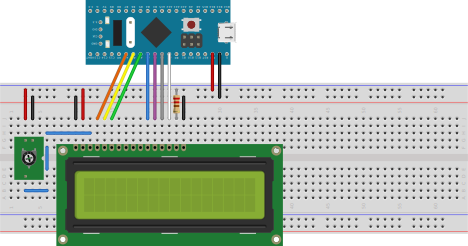
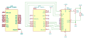
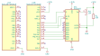

# <big>`03-gpio-lcd1602` Example</big>

The purpose of this example is to demonstrate the Lcd1602 class provided 
as an accessory on the **kits** folder.

This example will cover the GPIO and the some details on how to produce 
short delays to synchronize with hardware that is slower than your CPU.  
These details will be covered later.


## General schematics

The class Lcd1602 presented on this example interfaces a typical 16x02 
LCD display using a 4-bit data bus option.  
The following pictures illustrates the setup  or schematics, which 
depends on your MCU type. 


### STM32F103 BluePill

This connection diagram shows how to interface a BluePill with a standard 
LCD1602:



In general the following connections are required:

| MCU Port | LCD1602 Pin Label |
|:--------:|:-----------------:|
|   PA1    | RS                |
|   PA2    | R/W               |
|   PA3    | E                 |
|   PA4    | DB4               |
|   PA5    | DB5               |
|   PA6    | DB6               |
|   PA7    | DB7               |

Other necessary connections are:
- **Vo:** a 10K trimmer used to calibrate the display intensity.
- **LEDA:** An optional 100R resistor. In most boards the resistor is 
provided embedded into de display hardware. Keep the resistor if you are 
not sure. This function controls the backlight.
- **LEDK:** Connect this to the ground.
- **VDD:** Supply voltage. Connect this to the 3.3V.
- **VSS:** Connect this to the ground.

> Note that RS and R/W are placed in a ascending sequence and the same is 
> also valid for DB4 - DB7. The reason will be explained later when we 
> dive into implementation details.


### Nucleo-L432KC

This is identical to the BluePill but another form factor; this is the 
schematics for this setup:




### Nucleo-G431KB

Although this board is very similar to the Nucleo-L432KC, the PA3 is not 
connected by default. So for this example to work, PA0 replaces the PA3 
function.

> For all examples of this toolkit, the 24 MHz crystal is used as 
> default clock. For this to work, you should ensure the solder bridges 
> **SB9** and **SB10** are closed.




## Include File

The `LCD1602.h` provided in the kit folder is not included by default 
when you include the `<bmt.h>` header file.

So provide the required include file, like the example:

```cpp
#include <bmt.h>
#include <kits/lcd1602.h>	// required for the LCD1602 display class

// Declare namespaces to reduce verbosity of the source code
using namespace Bmt;
using namespace Bmt::Kits::Lcd1602;
```


## Data-Types for the Project Implementation

Like all previous examples a clock tree is necessary, which is 
conventionally called `SysClk`. Also GPIO is required. All these types 
can be found on each *`hal.xxx.h`* file, which depends solely on your 
MCU type:

```cpp
#ifdef STM32F103xB
#   include "hal.f103.h"
#elif defined(STM32L432xx)
#   include "hal.l432.h"
#elif defined(STM32G431xx)
#   include "hal.g431.h"
#else
#   error Unsupported configuration
#endif
```

For example, in the *BluePill* the `"hal.f103.h"` file is loaded, and the 
following types are defined:

| Data type | Usage                                                   |
|-----------|---------------------------------------------------------|
| `Hse`     | Manages the 8MHz externally mounted crystal             |
| `SysClk`  | Manages the clock tree sourcing all hardware buses.     |
| `InitPA`  | State of Port A for initialization.                     |
| `InitPB`  | State of Port B for initialization.                     |
| `InitPC`  | State of Port C for initialization.                     |
| `Led`     | The LED mounted on this board (not used in this sample) |
| `Delay`   | Class with utilities that produces short delays         |
| `Tick`    | Class for longer delays                                 |
| `Lcd`     | Data-type that drives the LCD1602 hardware              |

> **Note 1:** Other *HAL* files have similar contents.

> **Note 2:** For details on the clock tree you should check example 
> **1)** and **2)**. 


## Initialization

By STM32 convention, the `SystemInit()` is used to initialize the system 
clock. This happens before the C/C++ library has a chance to initialize 
itself, which means that **no object or variable can be used at this 
point**. 

Since all our hardware elements are also initialized using static 
functions, we break this convention and add also other initialization 
code:


```cpp
/*
This function is required by STM32 startup file and called during
initial startup.
*/
extern "C" void SystemInit()
{
    // Reset clock system before starting program
    System::Init();
    // Initialize Port A, B and C
    InitPA::Init();
    InitPB::Init();
    InitPC::Init();
    // Starts desired clock
    SysClk::Init();
    // Start tick counter
    Tick::Init();
}
```

> Note that the LCD class requires an object instance, so we cannot do 
> this now. This object is initialized later on the `main()` function.


# General Description of the Example Functionality

This example does the following:
- Creates an instance of the MicroStopWatch<> class to control up-counter 

```cpp
// A 100 millisecond timer used to update current time (auto-reload mode)
Timer::MicroStopWatch<Tick, Tick::ToTicks(Timer::Msec(100))> t;
```

- Creates an instance of the LCD1602 class and initialize it.

```cpp
// Instance of the LCD1602
Lcd lcd;
// Initialize LCD controller
lcd.InitLcd();
```

- Writes the *"Hello World!"* message on the first line. This line 
remains static during runtime.

```cpp
// Write static text on the first line
lcd.Write("Hello World!");
```

- A counter starting with 0 is initialized. This is the total amount of 
tenths of a second passed since the start of the program.

```cpp
unsigned int v = 0;
```

- An infinite loop is established, performing the following steps:
  - Calls the `WriteElapsedTime()` function to update the second line the 
  value of the counter
  - Halts MCU as long as the programmed interval does not overflows.
  - Meanwhile, for every timer overflow, check the internal LCD 
  `IsLocked()` method to update internal timers. Later we will discuss 
  why this was done.
  - After the timer period overflows, the counter variable is incremented 
  registering the next tenth of a second. The infinite loop repeats after 
  this step.

```cpp
// Display duration forever
while (true)
{
    // Update second line
    WriteElapsedTime(lcd, v);
    // Now wait until stopwatch overflows
    while (t.IsNotElapsed())
        lcd.IsLocked();	// 'ping' internal timer
    // Increment 100 ms counter
    ++v;
}
```


## Comments and Tricks

Consider the following points:


### Call Rate for the `IsLocked()` method

This requirement is covered in detail on the previous example, where four 
different timer approaches are covered.

In general, the reason is that these polled timers have to be *checked* 
on a rate higher than the system tick timer overflow period, in this way 
we can increase the resolution of the tick value to 32 bits, allowing for 
longer periods.

> The call rate in this particular example is far higher then the 
> necessary. This is simply because we have no other activity to do, due 
> to the simplicity of the example. The interval between two consecutive 
> calls could be larger (i.e. less calls per seconds); the only important 
> requirement is that the call rate is higher than the period of the 
> system tick timer, quite similar to an application using a watchdog, 
> that needs to touch the peripheral unit before it counter reaches the 
> programmed period.


### Printing of the Second Line

The printing of the second line is implemented in `WriteElapsedTime()`.

In this example we establish a 32-bit counter that increments every 
**100 ms**. When printing, standard integer conversion is performed using 
the `__utoa()` function. Then the floating point '.' separator is 
inserted into that buffer.

```cpp
// Format counter to decimal value
__utoa(v, buf, 10);
// Move last digit one position away
l = strlen(buf);
buf[l] = buf[l - 1];
// insert decimal dot
buf[l - 1] = '.';
// Update string size and add terminator
buf[++l] = 0;
```

Last but not least, the output is computed so that a right alignment is 
obtained and *seconds* units is appended to the tail.

```cpp
// Compute padding required for move text to the right margin
l = 14 - l;
// prepend spaces
while (l--)
    lcd.Write(' ');
// Write string with current time
lcd.Write(buf);
// Add time unit
lcd.Write(' ');
lcd.Write('s');
```

Another particularity of this function is that counter values between 
**0** and **9**. If we pass a value in that range into the solution 
presented above you would obtain outputs like:
- `.0`
- `.1`
- ...
- `.9`

To avoid this phenomenon a special case was added for this range:
```cpp
// Values below 10 are special: prepend '0' for fake floating point
if (v < 10)
{
    // Produces "0.0", "0.1", ..., "0.9"
    buf[0] = '0';
    buf[1] = '.';
    buf[2] = (char)('0' + v);
    buf[3] = 0;
    l = 3;	// length of the printable string
}
else
{
    // as already showed, use utoa() to convert value
    // ...
}
```

> One typical recommendation is to try to use integers instead of a 
> floating point. This rule is even more important on embedded 
> development, where a FPU is rarely available. Computing of FP math 
> consume much more resources than simple integer operations.  
> Even for a Cortex-M4 with FPU, you are limited to single precision and 
> according to IEEE754, single precision uses a mantissa of 23 bits. In 
> other words, a 32-bit integer will have more computing room for a 
> counter implementation.


# Grouping GPIO pins

GPIO pins are very easy to use when handling simple on/off bits. Things 
gets complicated when we need to group pins to operate larger binary 
values. 

The **bmt** library contains a class that allows you to group pins and 
easily write a value at once.

## The `AnyCounter<>` Template Class

As already mentioned, this example uses the **LCD1602** *kit* class and 
this class implements a 4-bit data bus used to transfer nibbles to the
LCD controller.

This is implemented by the `AnyCounter<>` template class, which allows 
one to group up to 4 bits and use it as a counter.

Lets show a code snippet of this implementation:

```cpp
template <
    ...
    const Gpio::Port kPort = Gpio::Port::PA,	//!< The GPIO port
	...
    const uint8_t kD4 = 4,						//!< D4 line of the LCD1602
    const uint8_t kD5 = 5,						//!< D5 line of the LCD1602
    const uint8_t kD6 = 6,						//!< D6 line of the LCD1602
    const uint8_t kD7 = 7						//!< D7 line of the LCD1602
>
class AnyLcd1602
{
    ...
    // Configuration for driving pin D4 as output
    typedef Gpio::AnyOut<kPort, kD4> D4_;
    // Configuration for driving pin D5 as output
    typedef Gpio::AnyOut<kPort, kD5> D5_;
    // Configuration for driving pin D6 as output
    typedef Gpio::AnyOut<kPort, kD6> D6_;
    // Configuration for driving pin D7 as output
    typedef Gpio::AnyOut<kPort, kD7> D7_;
    // Output direction data-type
    typedef Gpio::AnyPinGroup<kPort, D4_, D5_, D6_, D7_> OutPins_;

    // Configuration for reading pin D4 as input
    typedef Gpio::AnyIn<kPort, kD4, Gpio::PuPd::kPullDown> D4in_;
    // Configuration for reading pin D5 as input
    typedef Gpio::AnyIn<kPort, kD5, Gpio::PuPd::kPullDown> D5in_;
    // Configuration for reading pin D6 as input
    typedef Gpio::AnyIn<kPort, kD6, Gpio::PuPd::kPullDown> D6in_;
    // Configuration for reading pin D7 as input
    typedef Gpio::AnyIn<kPort, kD7, Gpio::PuPd::kPullDown> D7in_;
    // Input direction data-type
    typedef Gpio::AnyPinGroup<kPort, D4in_, D5in_, D6in_, D7in_> InPins_;

    // Groups 4 bits and operate them as a counter (values 0 to 15)
    typedef Gpio::AnyCounter<D4_, D5_, D6_, D7_> DataBus_;
    ...
};
```

Lets explain the type definitions shown above.

### Template Parameters

Template parameters lets you specify the GPIO port and pins that have to 
be used:
- All pins have to be from the same port
- Template labels uses the perspective of the LCD1602 bus.
- The default template is **PORT A** and **[4,5,6,7]** pins, but:
  - It is highly recommended to choose a group of pins organized in 
  ascending order like: 
    - [0,1,2,3],
    - [1,2,3,4],
	- ... 
	- [12,13,14,15]
  - No specific order is required. For example, you could specify 
  [7,15,4,1] and the group will work as specified. But in this case the 
  class implementation produces a much slower code as compared to a well 
  organized set.

### Data Bus Configured as *Output*

The first four `typedef` statements defines how we want each pin 
configured when acting as output pins.  
This hardware expects push/pull pins, but others may required an open 
drain interface. That is a design constraint.

The next `typedef` specifies the group of pins to be used to setup the 
port at once. This joins all specified pins and programs the GPIO ports 
in a bulk.

### Data Bus Configured as *Input*

The next group of `typedef` statements defines how these pins behaves 
when they are used as input. 

Again this is a design constraint and in our case we chose to use 
pull-downs which will make sure that a stable level is read, even if a 
cable is not firmly connected. 

> When interfacing to other chips than an LCD, a floating pin or pull-ups 
> is the way to go.

The last `typedef` of this block specifies the pins that have to be 
joined into a group. The setup of the GPIO will occur in a bulk, for all 
pins together.

### Group of Pins to be Used as a *Counter*

The last `typedef` introduces the `Gpio::AnyCounter<>` template class. 
These are some of the key features of this class:
- Class is designed to manage up to four pins using a single GPIO access. 
- It maps the lower lower bits of the passed value to the respective 
output pins.
- The same is also valid when reading the port. 
- It is designed to take advantage if the set of bits is a sequential 
ascending set of pins, where only masking and bit shift are required for 
the transfer.
- Any possible order for the bits are allowed, but if not sequential and 
ascending, read performance will have an impact.
- In the case you establish a 4 bit group, input/output values ranges 
from 0 to 15.

## Putting it All Together

The following code snipped explains how to combine these type definitions 
to interface a 4-bit bus. In the example we consider that bus direction 
is by default as output. This is a design decision and depends on the 
hardware type you are interfacing.

So the initialization of the bus goes like this:

```cpp
// This function initializes the 4-bit bus
void InitBus()
{
#if GPIO_NEVER INITALIZED
	// This makes only sense when GPIO has never been Init'ed
	OutPins_::Init();	// this is not recommended; just put all 
						// init on a single place
#else
	// Default way to go: Pins are driving the bus
	OutPins_::Enable();
#endif
}
```

> Note that the `OutPins_` definition is used to handle pin configuration. 

To write nibble (a value between 0 and 15) to this bus, is just as easy 
as: 

```cpp
void WriteData(uint8_t v)
{
	DataBus_::Write(v);
}
```

And when we want to read a nibble, we switch the bus as input before 
reading the nibble:

```cpp
uint8_t ReadData()
{
	// Switch the bus to input mode
	InPins_::Enable();
	// Read the value on the bus
	uint8_t v = DataBus_::Read();
	// Drive the bus again
	OutPins_::Enable();
	return v;
}
```

This example switches bus direction to input before reading the bus. 
After this, the bus direction is switched to output.

### Bus control and timing

Note that this example is minimalist. Interfaces generally have control 
signals to indicate if operation is input or output, like the R/W line 
of the LCD1602. Other issue with external hardware is that signals 
hare constrained by minimal latencies that have to be respected. 

A timing chart is part of the data-sheet of any interface device and 
we need to check that all these constraints are accomplished to have 
successful transfers. 

The snippets show before needs to be expanded to be really functional. 
The next topic shows a typical timing chart and the ways to introduce 
the required latencies.

# Interfacing MCU with slower hardware

## Timing of the HD44780U controller chip

The following chart was extracted from the HD44780U controller chip 
data-sheet, found on a typical LCD1602 module. The chart describes the 
minimum timing requirements for a bus transfer: 


<div hidden>
```
@startuml hd44780u
hide time-axis
concise "RS" as RS
binary "RW" as RW
binary "EN" as E
concise "DB0 to DB7" as DB
RS is ""
RW is high
DB is ""
@0
RW is high
E is low
@1
RS is "Instruction/Data"
RW is low
@2
E is high
@3
DB is "valid data"
@5
E is low
@6
DB is ""
RS is ""
RW is high
@7
RS is ""
RW is low
@8
E is high
@RW
@5 <-> @6 : 10 ns
@E
@1 <-> @2 : 40 ns
@2 <-> @5 : 230 ns
@5 <-> @8 : 220 ns
@DB
@2 <-> @3 : 80 ns
@5 <-> @6 : 10 ns
@enduml
```
</div>

Note that some of the timing is in the **10 ns** range and other states 
can last more than **100 ns**. But on a STM32 CPU running at 8 MHz we can 
see timings as short as **125 ns**, which depends on prefetch and cache 
state. 

So to communicate with this hardware we have to ensure that some pulses 
have minimum duration which may be easily overrun by the CPU at higher 
clock rates.

The `AnyLcd1602<>` template class illustrates an implementation of such 
timing constraints.  
This is an excerpt from the `WriteInstruction4()` method:

```cpp
static constexpr uint32_t kSlopeWidth_ = 500;
//...
static constexpr void WriteInstruction4(const uint8_t v)
{
    EN_::SetHigh();
    DataBus_::Write(v);
    Delay_::template DelayNS<kSlopeWidth_>();
    EN_::SetLow();
    Delay_::template DelayNS<kSlopeWidth_>();
}
```

If you check the timing chart at the start of this topic, you will see 
that the width of the positive slope of the **EN** signal is **230 ns**. 
We establish a **500 ns** here for two reasons:
- When MCU is running at 8 MHz boundary, internal cache and instruction 
prefetch may cause severe timing changes, depending on the CPU internal 
state. We have to add more room for this internal variations.
- Cabling may cause signal degradation, so it is a good to have this 
additional room.

> Tests revealed that increasing CPU speed will produce more accurate 
> delays when timing is near the instruction cycle. Actually we could 
> run this test using **250 ns** instead of **500 ns**. But keep in mind 
> that safety margins is the wisest option.


### The *Bit Brushing* C++ Syntax

In general, the **bmt** library trie to offer the `constexpr` variant of 
these delay functions, since timing is very critical and a call to a 
routine like the division algorithm is out of the question.  
Newer compilers are really good on avoiding such pitfalls, specially with 
*inline functions*. But as a good advice, you should try to use the 
`constexpr` as much as possible.

As a real drawback compilers cannot understand the nesting of templates, 
like the example shown above.

Lets take the following source code line, to illustrate this issue:

```cpp
Delay_::template DelayNS<kSlopeWidth_>();
```

Lets disclose what the `Delay_` element is:
- This is an input parameter to the template definition:

```cpp
template <
	typename Delay,				//!< Short delays class to produce 
								//!< small nanosecond pauses
	typename PolledStopWatch,	//!< A timer class with a ms stopwatch
	// ...
>
class AnyLcd1602
{
	//...
public:
	typedef Delay Delay_;
	//...
};
```

- The requirement for this argument is to be one of the timer classes 
that provides accurate time units.
- It is an external template argument because it depends on a hardware 
unit like the system tick timer or another of the TIMx timers. Regardless 
of the timer unit used, the tick frequency depends on the system clock.

>  Note that the LCD1602 template class expects two timer references: one 
> that is able work with nanoseconds and another for longer durations.

The type definition for the Delay timer occurs in the *hal.xxx.h* 
file and for the STM32F103 this is:

```cpp
typedef Timer::AnyDelay<SysClk> Delay;
```

The `AnyDelay<>` template class offers a `constexpr`-optimized internal 
class called `DelayNS<>`, which is also a template class.

> If you check this class you will see that it offers a non-`constexpr` 
> version for nanoseconds delays, but when we take the `constexpr` 
> version we are telling the compiler: *"Hey, we are handling all 
> parameters with fixed constants, so you can solve all computation 
> during compilation, not in runtime!"*

So we are compiling a template, that consumes another template that 
contains another template class. *Ouch!*  
So from the first template perspective this would look like this:

```cpp
Delay_::DelayNS<kSlopeWidth_>();	// compilation error
```

But this is not a valid syntax when compiler is compiling the `Delay_` 
parameter, because it has no clue what this argument is. It is just a 
straight `typename Delay`. It will stop with an error in the 
`<kSlopeWidth_>` element, because here it is expecting a variable or a 
function call.  
So we need to **explicitly say** that we are nesting templates and the 
line then changes to:

```cpp
Delay_::template DelayNS<kSlopeWidth_>();
```

The C++ standard is sometimes very difficult and produces almost 
unreadable code: having hard times instead of producing code...

