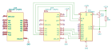
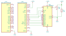
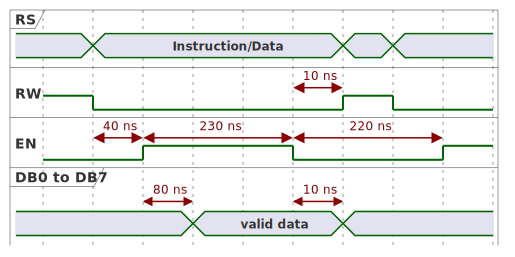

# <big>`03-gpio-lcd1602` Example</big>

The purpose of this example is to demonstrate the Lcd1602 class provided 
as an accessory on the **kits** folder.

This example will cover the GPIO and the some details on how to produce 
short delays to synchronize with hardware that is slower than your CPU.  
These details will be covered later.


## General schematics

The class Lcd1602 presented on this example interfaces a typical 16x02 
LCD display using a 4-bit data bus option.  
The following pictures illustrates the setup  or schematics, which 
depends on your MCU type. 


### STM32F103 BluePill

This connection diagram shows how to interface a BluePill with a standard 
LCD1602:


In general the following connections are required:

| MCU Port | LCD1602 Pin Label |
|:--------:|:-----------------:|
|   PA1    | RS                |
|   PA2    | R/W               |
|   PA3    | E                 |
|   PA4    | DB4               |
|   PA5    | DB5               |
|   PA6    | DB6               |
|   PA7    | DB7               |

Other necessary connections are:
- **Vo:** a 10K trimmer used to calibrate the display intensity.
- **LEDA:** An optional 100R resistor. In most boards the resistor is 
provided embedded into de display hardware. Keep the resistor if you are 
not sure. This function controls the backlight.
- **LEDK:** Connect this to the ground.
- **VDD:** Supply voltage. Connect this to the 3.3V.
- **VSS:** Connect this to the ground.

> Note that RS and R/W are placed in a ascending sequence and the same is 
> also valid for DB4 - DB7. The reason will be explained later when we 
> dive into implementation details.


### Nucleo-L432KC

This is identical to the BluePill but another form factor; this is the 
schematics for this setup:




### Nucleo-G431KB

Although this board is very similar to the Nucleo-L432KC, the PA3 is not 
connected by default. So for this example to work, PA0 replaces the PA3 
function.

> For all examples of this toolkit, the 24 MHz crystal is used as 
> default clock. For this to work, you should ensure the solder bridges 
> **SB9** and **SB10** are closed.




## Include File

The `LCD1602.h` provided in the kit folder is not included by default 
when you include the `<bmt.h>` header file.

So provide the required include file, like the example:

```cpp
#include <bmt.h>
#include <kits/lcd1602.h>	// required for the LCD1602 display class

// Declare namespaces to reduce verbosity of the source code
using namespace Bmt;
using namespace Bmt::Kits::Lcd1602;
```


## Data-Types for the Project Implementation

Like all previous examples a clock tree is necessary, which is 
conventionally called `SysClk`. Also GPIO is required. All these types 
can be found on each *`hal.xxx.h`* file, which depends solely on your 
MCU type:

```cpp
#ifdef STM32F103xB
#   include "hal.f103.h"
#elif defined(STM32L432xx)
#   include "hal.l432.h"
#elif defined(STM32G431xx)
#   include "hal.g431.h"
#else
#   error Unsupported configuration
#endif
```

For example, in the *BluePill* the `"hal.f103.h"` file is loaded, and the 
following types are defined:

| Data type | Usage                                                   |
|-----------|---------------------------------------------------------|
| `Hse`     | Manages the 8MHz externally mounted crystal             |
| `SysClk`  | Manages the clock tree sourcing all hardware buses.     |
| `InitPA`  | State of Port A for initialization.                     |
| `InitPB`  | State of Port B for initialization.                     |
| `InitPC`  | State of Port C for initialization.                     |
| `Led`     | The LED mounted on this board (not used in this sample) |
| `Delay`   | Class with utilities that produces short delays         |
| `Tick`    | Class for longer delays                                 |
| `Lcd`     | Data-type that drives the LCD1602 hardware              |

> **Note 1:** Other *HAL* files have similar contents.

> **Note 2:** For details on the clock tree you should check example 
> **1)** and **2)**. 


## Initialization

By STM32 convention, the `SystemInit()` is used to initialize the system 
clock. This happens before the C/C++ library has a chance to initialize 
itself, which means that **no object or variable can be used at this 
point**. 

Since all our hardware elements are also initialized using static 
functions, we break this convention and add also other initialization 
code:


```cpp
/*
This function is required by STM32 startup file and called during
initial startup.
*/
extern "C" void SystemInit()
{
    // Reset clock system before starting program
    System::Init();
    // Initialize Port A, B and C
    InitPA::Init();
    InitPB::Init();
    InitPC::Init();
    // Starts desired clock
    SysClk::Init();
    // Start tick counter
    Tick::Init();
}
```

> Note that the LCD class requires an object instance, so we cannot do 
> this now. This object is initialized later on the `main()` function.


# General Description of the Example Functionality

This example does the following:
- Creates an instance of the MicroStopWatch<> class to control up-counter 

```cpp
// A 100 millisecond timer used to update current time (auto-reload mode)
Timer::MicroStopWatch<Tick, Tick::ToTicks(Timer::Msec(100))> t;
```

- Creates an instance of the LCD1602 class and initialize it.

```cpp
// Instance of the LCD1602
Lcd lcd;
// Initialize LCD controller
lcd.InitLcd();
```

- Writes the *"Hello World!"* message on the first line. This line 
remains static during runtime.

```cpp
// Write static text on the first line
lcd.Write("Hello World!");
```

- A counter starting with 0 is initialized. This is the total amount of 
tenths of a second passed since the start of the program.

```cpp
unsigned int v = 0;
```

- An infinite loop is established, performing the following steps:
  - Calls the `WriteElapsedTime()` function to update the second line the 
  value of the counter
  - Halts MCU as long as the programmed interval does not overflows.
  - Meanwhile, for every timer overflow, check the internal LCD 
  `IsLocked()` method to update internal timers. Later we will discuss 
  why this was done.
  - After the timer period overflows, the counter variable is incremented 
  registering the next tenth of a second. The infinite loop repeats after 
  this step.

```cpp
// Display duration forever
while (true)
{
    // Update second line
    WriteElapsedTime(lcd, v);
    // Now wait until stopwatch overflows
    while (t.IsNotElapsed())
        lcd.IsLocked();	// 'ping' internal timer
    // Increment 100 ms counter
    ++v;
}
```


## Comments and Tricks

Consider the following points:


### Call Rate for the `IsLocked()` method

This requirement is covered in detail on the previous example, where four 
different timer approaches are covered.

In general, the reason is that these polled timers have to be *checked* 
on a rate higher than the system tick timer overflow period, in this way 
we can increase the resolution of the tick value to 32 bits, allowing for 
longer periods.

> The call rate in this particular example is far higher then the 
> necessary. This is simply because we have no other activity to do, due 
> to the simplicity of the example. The interval between two consecutive 
> calls could be larger (i.e. less calls per seconds); the only important 
> requirement is that the call rate is higher than the period of the 
> system tick timer, quite similar to an application using a watchdog, 
> that needs to touch the peripheral unit before it counter reaches the 
> programmed period.


### Printing of the Second Line

The printing of the second line is implemented in `WriteElapsedTime()`.

In this example we establish a 32-bit counter that increments every 
**100 ms**. When printing, standard integer conversion is performed using 
the `__utoa()` function. Then the floating point '.' separator is 
inserted into that buffer.

```cpp
// Format counter to decimal value
__utoa(v, buf, 10);
// Move last digit one position away
l = strlen(buf);
buf[l] = buf[l - 1];
// insert decimal dot
buf[l - 1] = '.';
// Update string size and add terminator
buf[++l] = 0;
```

Last but not least, the output is computed so that a right alignment is 
obtained and *seconds* units is appended to the tail.

```cpp
// Compute padding required for move text to the right margin
l = 14 - l;
// prepend spaces
while (l--)
    lcd.Write(' ');
// Write string with current time
lcd.Write(buf);
// Add time unit
lcd.Write(' ');
lcd.Write('s');
```

Another particularity of this function is that counter values between 
**0** and **9**. If we pass a value in that range into the solution 
presented above you would obtain outputs like:
- `.0`
- `.1`
- ...
- `.9`

To avoid this phenomenon a special case was added for this range:
```cpp
// Values below 10 are special: prepend '0' for fake floating point
if (v < 10)
{
    // Produces "0.0", "0.1", ..., "0.9"
    buf[0] = '0';
    buf[1] = '.';
    buf[2] = (char)('0' + v);
    buf[3] = 0;
    l = 3;	// length of the printable string
}
else
{
    // as already showed, use utoa() to convert value
    // ...
}
```

> One typical recommendation is to try to use integers instead of a 
> floating point. This rule is even more important on embedded 
> development, where a FPU is rarely available. Computing of FP math 
> consume much more resources than simple integer operations.  
> Even for a Cortex-M4 with FPU, you are limited to single precision and 
> according to IEEE754, single precision uses a mantissa of 23 bits. In 
> other words, a 32-bit integer will have more computing room for a 
> counter implementation.


# Interfacing MCU with slower hardware

## Timing of the HD44780U controller chip



```
@startuml hd44780u
concise "RS" as RS
binary "RW" as RW
binary "E" as E
concise "DB0 to DB7" as DB
@-1
RS is ""
RW is high
E is low
DB is ""
@0
RS is "Operation"
RW is low
@4
E is high
@6
DB is "valid data"
@12
E is low
@20
DB is ""
RS is ""
RW is high
@24
E is low
@enduml
```


