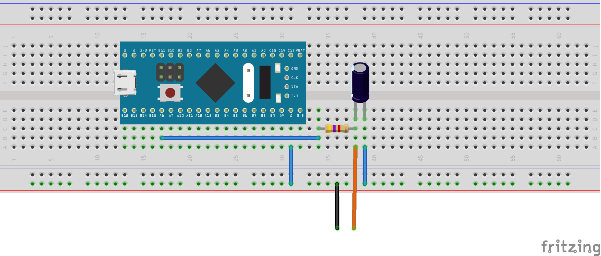
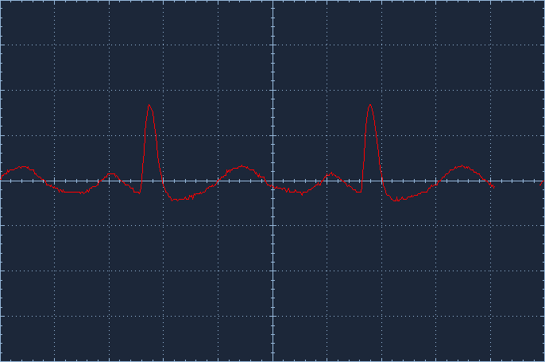

# <big>`06-dma-pwm` Example</big>

This example shows an implementation of an ECG simulator using DMA an 
PWM.  
The implementation uses two timers for the generation of the ECG signal. 
One for the PWM and the other provides timely samples, through a DMA 
trigger. 

In the next topics we discuss implementation details.


# ECG Samples

A table having ordered samples of a complete ECG cycle is provided in the 
**main.cpp** file. It is declared as the **`s_EcgTable`** constant array 
and it contains all samples in absolute offset values, which means that a 
value of 127 you have the baseline of the EEG complex. Value above this 
reference are positive and all other values are negative.

The table contains a minimal representation of an ECG, where the Heart 
muscle has any kind of electrical activity. This means that between two 
heart beats there is no activity and a iso-electric line is left running 
(i.e. PWM ratio is left unchanged).


# Timer to generate PWM

The **Channel 1** of **TIM1** is used to produce the PWM signal. It is 
clocked at a high frequency (1 MHz) and has 256 counter steps for each 
cycle. Not incidentally, this step count provides conversion of a byte 
value to the respective PWM ratio. 

So, a byte value of 0 will produce no output, while the value of 255 
produces the maximal output. The byte value shall be written to the 
**CCR1** (*Capture Compare Register*) register of **TIM1** and a new 
ratio takes effect. 


> Source: [Real Digital](https://www.realdigital.org/doc/6136c69c3acc4bf52bc2653a067e36cc)

The timer is programmed to use shadow registers, which means that values 
that are written to the registers are not applied instantly. They are 
stored in a cache register and only when the timer updates they are 
copied to the actual register. This has the advantage that samples can 
be provided asynchronously to the **TIM1** period. 


# Sample Rate Timer

In this example **TIM2** is used to control the rate in which ECG samples 
are transferred to the **CCR1** register of **TIM1**.  
This is done autonomously and stops at the end of the ECG sample block.
A new cycle is started by the main routine, which controls the simulated 
heart rate.

For the TIM2 counter we set a dummy value of 100 counts, just to keep 
math simple, but it could be any value, since the timer is dedicated for 
this duty.

The sample rate depends on the desired BPM that the example will 
simulate and once programmed it will remain running at a constant rate. 

> If you choose a higher BPM, a slight increase is added to the sample 
rate, stretching the QRS. This is very limited since also human body 
cannot change the activity within a running beat too much and increasing 
the heart rate to a limit where two beats overlaps will break the logic 
of the program. In human body this is also not allowed and could be the 
cause for uncontrolled heart beat runs. 

On every update of this timer, a trigger is produced to cause a DMA 
transfer. 


# DMA Transfers

The DMA is used to copy an entry of the ECG Samples table to the **CCR1** 
register of **TIM1**. When no more samples are left the DMA stops the 
transfer.

So, the main program start the DMA to trigger an initial QRS pulse. Then
a software timer attached to one of the timers is used to compute the 
delay required for the specified heart rate. 

The main program waits until the heart rate period elapses to trigger the 
next DMA transfer. Aside from the control of the LED, the main program 
just waits until the next heart rate period expires, to trigger a new DMA 
transfer.

Like we saw before, on each TIM2 update, the DMA transfers a byte to the 
Channel 1 of TIM1 and specifies the PWM ratio. This progressively 
modulates the amplitudes on the filtered output pin and produce the QRS 
wave. 


# Band Pass Filter

The period of the timer is 256 µs, which is almost 4 kHz. ECG frequencies 
are in a on much lower. This enormous difference allows us to use a very 
simple band-pass filter.

This filter has the ability to convert the pulse ratio into a constant 
voltage, like in the picture:


> Source: [Real Digital](https://www.realdigital.org/doc/6136c69c3acc4bf52bc2653a067e36cc)

For this example we chose very generic values for the R/C filter, but 
they produce quite good results. Note that if the cutoff frequency of the 
filter is too high the output is contaminated with additional noise 
caused by the pulse switching. On the other side too low cutoff 
frequencies will attenuate the ECG signal, which hinders the resulting 
wave. 

> Filter design is not the purpose of this example, which is a actually 
a very complex matter.  
> For production quality design it is recommended to let an analog 
electronics specialist design it.


# Other Analog Conversion Limitations

To keep the test simple, no AC decoupling of the PWM output is performed 
and result shall be observed using an oscilloscope. ECG signals have very 
low frequency and most slopes, like the ST segment, are very sensitive 
to the results interpretation. A good DC decoupling is normally a 
design effort also not covered by this example. 

Another issue is that PWM will produce values in the range of 0 and 3.3V, 
which is not compatible to human body, including any ECG capturing 
device.  
Usually, the human heart produces voltages below 10 mV.  
A good approach is to attenuate the PWM filtered output by a factor of up 
to 1000 and signal will be quite compatible with any ECG device found on 
the market. This is not covered by the circuit presented in this example.

> Actually, by hypothetically applying a 1000 factor attenuation, you 
will also attenuate the DC level, by the same factor, which turns your 
signal compatible with all EG devices, even without AC decoupling. Human 
body and electrodes, can easily introduce 100 or 200mV of DC offset, 
which are internally compensated by any professional ECG capturing 
device. 


# Comments to the Source Code


The example is build around the **examples\06-dma-pwm\main.cpp** file. 


## Including the **bmt** Library

It starts with the inclusion of the **bmt** library and a declaration to 
solve its namespace:

```cpp
#include <bmt.h>

using namespace Bmt;
using namespace Bmt::Timer;
```


## Handling Multiple Targets

Since the example can be tested in three different STM32 boards an 
include file is added, controlled by the build environment:


```cpp
#ifdef STM32F103xB
#	include "hal.f103.h"
#elif defined(STM32L432xx)
#	include "hal.l432.h"
#elif defined(STM32G431xx)
#	include "hal.g431.h"
#else
#error Unsupported configuration
#endif
```

Each include file specifies the following:
- Clock configuration
- The `SignalOut` data-type, which details the pin used as output. 
- The `InitPA`, `InitPB` and `InitPC` used to setup the GPIO.
- The `kPwmTimer` constant that specifies which timer is used to produce 
PWM output. 
- The `kPwmOutChannel` constant that specifies the Channel of the 
`kPwmTimer` timer where the PWM actually is implemented. 
- The `kUpdateTimer` constant that specifies which timer is used to 
control the rate that ECG samples are programmed into the PWM.
- The `IdDmaUpdate` constant that is used as DMA identification to 
resolve the correct DMA channel where ECG data will flow. 
- The `LedOn()`, `LedOff()` and `IsLedOn()` inline methods that allows 
the control of the LED. 

Then two contants are defined: a table containing the ECG samples and the 
count of elements on it:


## ECG Samples Table

```cpp
// This table contains an ECG sample using Absolute Offset Bytes format.
static constexpr uint8_t s_EcgTable[] =
{
	0x2D, 0x2D, 0x2F, 0x30, 0x31, 0x32, 0x34, 0x34,
	//...
	0x2D, 0x2D, 0x2C, 
};

// Size of the table containing ECG samples
constexpr uint32_t kTableSize = _countof(s_EcgTable);
```


## Data-types for the PWM Timer

The next step is to define data-types to setup the PWM timer, based on 
the information taken from the header file. 

```cpp
// Computes the prescaler for 1 MHz counter speed
typedef InternalClock_Hz <kPwmTimer, SysClk, 1000000> PwmFreq;
// PWM should quantize a byte (0-255), producing almost 4 kHz PWM sample rate
// A ~50 Hz low pass filter is required to produce the ECG signal
typedef Any<PwmFreq, Mode::kUpCounter, 255> Pwm;

// The output channel, attached to PWM timer
typedef AnyOutputChannel<Pwm
	, kPwmOutChannel
	, OutMode::kPWM1
	, Output::kEnabled
	, Output::kDisabled
	, true
	, true
> PwmOut;
```

The definitions establishes a PWM frequency of 1 MHz, and a PWM counting 
range between 0 and 255, corresponding exactly to 8 bits resolution. 
The third definition is used to program the timer channel to operate as 
output in PWM mode.


## Constants for the Heart Beat Generation

This setting requires quite more constants and data-types to be defined: 

```cpp
// Heart rate (Hard coded for this example; recompile for any feasible BPM)
constexpr uint32_t kBPM = 60;

// Data rate varies a bit so ECG image won't overlap on higher BPM rates
constexpr uint32_t kSPS = kBPM > 60 
	? 400 + 3*(kBPM - 60)
	: 400
	;
```

The `kBPM` is a constant that specifies the *beats per minute* rate that 
we want to simulate. Practical values should be below 160 bpm.

The `kSPS` constant is quite tricky: The default sample rate is 400 sps, 
but we increase it gradually if the `kBPM` constant is higher than 
60 BPM. This causes a slight stretch in the output pulse so it can still 
fit the desired heart rate.

To understand this, the programmed heart rate just starts the transfer of 
an entire beat. By increasing the heart rate we tend to have an overlap 
between the start and the end of the beat shape. By stretching the wave, 
we can avoid the overlap when increasing the heart rate.

> In the real world QRS-shape stretching is probably not common and it 
should rather tend to merge the starting P-pulse with the end of the 
T-wave. Nevertheless, as most of us know, there is a practical limit to 
this phenomenon, described by physicians as *tachycardia*, which is 
life-threatening. 


## Data-types for the Sample Rate Timer

These are the definitions for the timer responsible for the sample rate 
generation:

```cpp
// We want to specify dummy counts on update timer, within updates
// (this increases timer clock frequency and make it suitable for higher clock frequencies)
constexpr uint32_t kDummyCount = 100;

// Computes the prescaler to copy table with ECG samples to the PWM (x kDummyCount)
typedef InternalClock_Hz <kUpdateTimer, SysClk, kDummyCount * kSPS> UpdateFreq;
// Updates PWM values on every counter overflow using DMA
typedef Any<UpdateFreq, Mode::kUpCounter, kDummyCount-1> Updater;
```

The `kDummyCount` is a constant that defines a number of internal timer 
counts until an overflow happens. The overflow triggers an update event, 
which triggers one DMA transfer.  
It could be any 16-bit value, but lower value tends to increase the timer 
clock, which has a direct impact on the internal prescaler register, 
also a 16-bit register. So, this value tends to shift the prescaler value 
to a feasible operating range, also if you increase the timer frequency. 
This means that on chips running at higher clock rates there is the 
possibility to overflow the 16-bit prescaler and the solution is to 
increase the *dummy* count value until the prescaler can operate in the 
hardware specified range.  
This value has to be chosen wisely. 

> On the newer STM32 parts we can operate on lower frequencies like 8MHz 
or less but also use the PLL to achieve 160 MHz or even more.  
In the worst case, for a `kSPS = 400` and a `kDummyCount = 1` we 
have `160000000 / 400 = 400000`, which is far more than the capacity of 
a 16-bit prescaler. This reduces to `4000` for `kDummyCount = 100` which 
is a viable value.

The `UpdateFreq` data type computes the prescaler value so that 
`kDummyCount * kSPS` transitions happens per second.

The `Updater` data-type establishes a timer configuration, clocked at the 
`UpdateFreq` rate, counting `kDummyCount` times between each update 
event. This is data-type that we will use to initialize the timer 
hardware to produce the required sample rate for our ECG simulator. 


## Data-type for the DMA

The next a data-type is defined to setup our DMA channel to pump data 
into the PWM timer each time the sample rate timer updates:

```cpp
// This DMA is triggered on every timer update
typedef Dma::AnyChannel<
	IdDmaUpdate
	, Dma::Dir::kMemToPer			// runs samples in a single shot then stop
	, Dma::PtrPolicy::kBytePtrInc	// source buffer are bytes
	, Dma::PtrPolicy::kLongPtr		// destination CCR register
> TheDma;
```

The `IdDmaUpdate` data-type was specified on the *Hardware Abstraction 
Layer* file (`hal.xxx.h`), which identifies the DMA device and channel. 
On the *BluePill* this is `Dma::IdTim2Up`, which is provided by the 
**bmt** library and identifies the DMA channel triggered when **TIM2** 
updates. 


## Data-type for the Stop Watch

A stop watch is used to control the start of each beat and it is defined: 

```cpp
// A stopwatch to control BPM rate
typedef MicroStopWatch <Pwm, Pwm::ToTicks(Msec(60 * 1000UL / kBPM))> Tick32;
```

The Tick32 is a type definition that will be used to create an stop watch 
instance, that will reprogram the `TheDma` DMA channel every time a new 
beat starts. This will autonomously draw a complete QRS-wave on the 
output. 


## System Initialization

The first executed function is the `SystemInit()`. This is part of the 
STM32 startup file implementation, which is responsible to initialize 
hardware in a very early stage, before the `main()` function is called: 

```cpp
extern "C" void SystemInit()
{
	// Reset clock system before starting program
	System::Init();
	// Initialize Port A, B and C
	InitPA::Init();
	InitPB::Init();
	InitPC::Init();
	// Starts desired clock
	SysClk::Init();
	// Init PWM output
	PwmOut::Init();
	// Init sample updater
	Updater::Init();
	// Sample updates using DMA
	TheDma::Init();
}
```

The routine calls `System::Init()`, which is provided by the **bmt** 
library as the first initialization method.  
GPIO comes next, then the clock system, timers and DMA.
Most of the `Init()` functions will enable clock for the peripheral. 


## Description of the `main()` Function

The main function is implements the very basic QRS simulator.

At the beginning the DMA is configured to transfer the first QRS-wave:

```cpp
	// Initialize DMA to transfer values to CCR0 of PWM Output
	TheDma::Start(s_EcgTable, PwmOut::GetCcrAddress(), _countof(s_EcgTable));
```

This command initializes the data pointers and counters of the DMA 
channel and allows the channel to operate as soon as a trigger signal is 
received. The following parameters are used:
- `s_EcgTable`: which is the base address of the ECG sample table, stored 
in the flash.
- `PwmOut::GetCcrAddress()`: Note that the target address is the CCR 
of the PWM. It is obtained from the `PwmOut` data-type, which is the PWM 
channel used for output.  
Note that if you choose another PWM channel the information will 
propagate and program will *magically* work.
- `_countof(s_EcgTable)`: This macro informs the total number of samples 
present on the samples table. This also results in a constant.

> Note that even if the DMA is ready for operation, transfer triggers are 
not happening, so no data is really transferred for now.

The next command enables the PWM, which will loop the counter at a high 
speed at the current pulse width ratio:

```cpp
	// Starts the PWM
	Pwm::CounterStart();
```

The width of the pulse depends on the current CCR value. As you have 
noticed, the address of the register was informed before, as target 
address of the DMA operation.

PWM is running for now, but it is not modulating a signal until we start 
to trigger DMA transfers. So, the next step will do this:

```cpp
	// Starts the first cycle of the PWM updater
	Updater::EnableUpdateDma();
	Updater::CounterStart();
```

The first statement enables the internal timer control flag that sends 
update triggers to the DMA device and the second statement starts the 
timer counter.

> Please do not be confused, `TheDMA` is a data-type that controls the 
DMA channel, while `Updater` controls the Timer, a constantly clocked 
counter, that produces triggers for the DMA device at a constant rate. 

Now that we are triggering the DMA at a constant rate, the ECG wave will 
be autonomously formed at the output. But just a single time and then DMA 
stops at the programmed *size* (the last parameter of `TheDma::Start()` 
statement shown before)

To next code lines will perpetuate the generation of ECG waves. But these 
have to be started at a defined `kBPM` *heart rate*. Recall that we 
declared the `Tick32` stopwatch data-type with the desired *heart rate*. 

Now an instance of this stop watch:

```cpp
	// This software timer establishes the Heart Rate
	Tick32 stopwatch;
```

> This stop watch is implemented in software, but ties to the PWM 
generation timer, which counts in a constant rate. Like we covered in the `04-timer-delay` example, we have to call `stopwatch.IsNotElapsed()` 
regularly to keep it updated, while ensuring that the elapsed period has 
completed. 

The next statement is an infinite loop, which is responsible for the 
generation of infinite QRS pulses until the power off happens.

```cpp
	while (true)
	{
		//...
	}
```

Now inside loop, we check if the stopwatch has elapsed. And in this case, 
the LED is turned on and a new QRS-beat is started:

```cpp
	// Tests if heart rate interval is elapsed
	if (!stopwatch.IsNotElapsed())
	{
		// Starts a LED blink to signal ECG cycle
		LedOn();
		// Restarts DMA for subsequent heart beats
		TheDma::Start(s_EcgTable, PwmOut::GetCcrAddress(), _countof(s_EcgTable));
	}
```

> Note that DMA transfers the programmed amount of data and stops (it 
enters the disabled state), Even if the sample-rate timer is still 
triggering DMA transfers, nothing happens after the programmed transfer 
count is reached.

An additional operation that we perform, is to turn the LED off after a 
reasonable period. So the DMA transfer count is checked and after a 
reasonable amount of data, the led is finally turned off:

```cpp
	else if (IsLedOn()
		&& (TheDma::GetTransferCount() < (7 * kTableSize / 8)))
	{
		// After a short period turn LED off
		LedOff();
	}
```

We could have used another stopwatch to control the LED, independently of 
the DMA state, but the example shows how to check the LED state and a way 
to track the DMA transfer.


# Testing the Example

The image below shows a suggested breadboard montage for this example:



The resistor value is a **4k7** and the capacitor is **1µF**.

The orange wire is the Oscilloscope positive probe and black wire is the 
ground. 

The next image shows the oscilloscope capture for this case:



> Note on the picture, that a ripple is present, which means that the 
band-pass filter is too smooth. As previously stated, the band-pass 
filter requires a more design efforts.


## Proposed Exercises

1. Try other `kBPM` values.
2. Try a solution to align LED pulse with the R wave (the slope with more 
amplitude). Currently LED pulse is aligned with the beat start (P-wave).  
**Hint:** The R wave happens at the 69'th DMA transfer.
3. Try to reconfigure the PWM to output using channel 2. Don't forget to 
rewire the GPIO hardware to use **PA9**.  
The interesting part of this example is that, besides the hardware, you 
will only need to specify a new value for the `kPwmOutChannel` constant 
in the *hal* file and recompile the project. You probably should try the 
same using regular libraries to see that this brings more headaches than 
expected.

